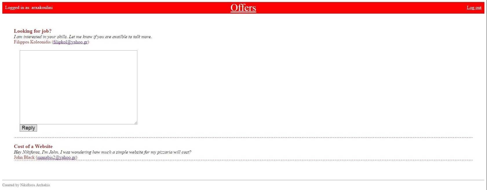
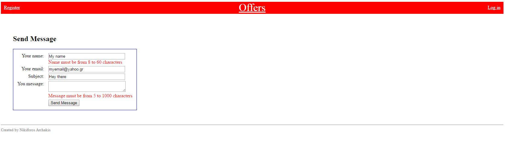
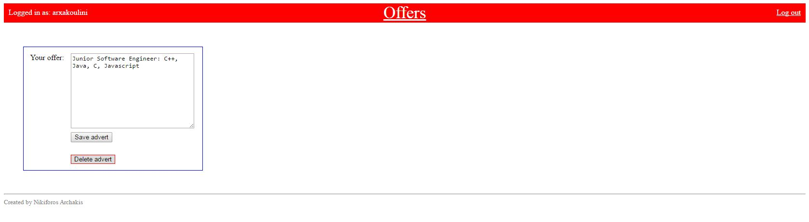

# Spring_MVC_Web_Application &nbsp; &nbsp; &nbsp; &nbsp; &nbsp; 
 
<i>The Spring Framework: Java's Popular Web Framework</i>

<h3>This is an advanced Spring Framework MVC Web application, which allows professionals to create offers about their skills in order to attract employers looking to hire.    For building this Project, a variety of open-source technologies and knowledge were used, including:</h3>

<i>(Links are targeting to relative code or files)</i>
 
 
<ul>
  <li>
      <b>Spring</b>
      <ul>
        <li>
            <a target="_blank" href="/src/com/caveofprogramming/spring/web/config/security-context.xml" >Spring Security </a>
        </li>
        <li>
             <a href="/WebContent/WEB-INF/flows/contact-flow.xml" target="_blank">Spring Webflow</a>
        </li>
        <li>
            <a href="/WebContent/WEB-INF/offers-servlet.xml" target="_blank">Spring Mail </a>
        </li>
      </ul>
  </li>
  <li>
      <b>Apache</b>
      <ul>
        <li>
            <a href="/WebContent/WEB-INF/layout/default.xml" target="_blank">Apache Tiles </a> 
        </li>
        <li>
            <a href="/pom.xml" target="_blank">Apache Maven </a> 
        </li>
        <li>
            <a href="/src/log4j.properties" target="_blank">Apache Log4j</a> 
        </li>
        <li>
            Apache Tomcat
        </li>
      </ul>
  </li>
  <li>
      <b>Java</b>
      <ul>
      <li>
            JEE 
        </li>
        <li>
            <a href="/WebContent/WEB-INF/tiles/" target="_blank">JSP </a> 
        </li>
        <li>
             <a href="/WebContent/WEB-INF/tiles/header.jsp" target="_blank">JSTL </a>   
        </li>
        <li>
            <a href="/test/com/caveofprogramming/spring/web/test/config/datasource.xml" target="_blank"> JDBC </a>
        </li>
      </ul>
  </li>

  <li>
    <a href="/src/com/caveofprogramming/spring/web/dao/OffersDAO.java" target="_blank"> <b>Hibernate + HQL</b> </a>
  </li>
  
  <li>   
     <a href="/test/com/caveofprogramming/spring/web/test/tests/" target="_blank"> <b>JUnit</b> </a> 
  </li>
  <li>
     <a href="/src/com/caveofprogramming/spring/web/controllers/LoginController.java" target="_blank"> <b>JSON</b> </a>  
  </li>
  <li>
    <a href="/WebContent/WEB-INF/tiles/messages.jsp" target="_blank"> <b>jQuery + AJAX</b> </a>   
  </li>
  <li>
    <a href="/WebContent/resources/css/main.css" target="_blank"> <b>HTML + CSS</b> </a>   
  </li>
  <li>
      <b>MySQL</b>
  </li>
      
</ul>
</b>

 

<table>
 	<tr>
		<td></td>
	</tr>
	
 	<tr>
		<td></td>
	</tr>
	
  	<tr>
		<td></td>
	</tr>
	
  	<tr>
		<td></td>
	</tr>
	
  	<tr>
		<td></td>
	</tr>
	
  	<tr>
		<td></td>
	</tr>
</table>
 
<ul>
  <li>October 2016, Thessaloniki, Greece</li>
  <li>Nikiforos Archakis</li>
</ul>

